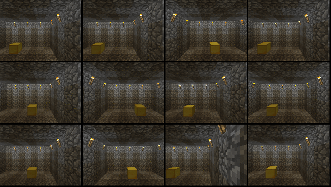
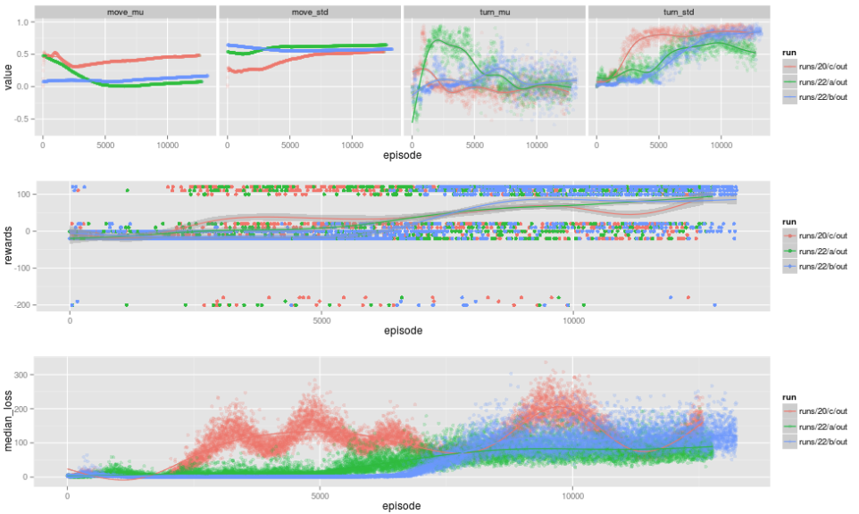

# malmomo

malmomo is the third in a series of deep rl projects.



the first was [drivebot](http://matpalm.com/blog/drivebot/) which trained a [DQN](https://www.cs.toronto.edu/~vmnih/docs/dqn.pdf)
to do discrete control of a simulated rover. it included work on using [domain adversarial nets](https://arxiv.org/abs/1505.07818)
to make the controller robust to both simulated & real input but never had the transfer of control from sim to real working properly...

phase 2 was [cartpole++](https://github.com/matpalm/cartpoleplusplus) where the focus was on continuous control and raw pixel
input. this work included training a baseline [likelihood ratio policy gradient](http://www-anw.cs.umass.edu/~barto/courses/cs687/Policy%20Gradient-printable.pdf)
method for the low dimensional problem (7d pose of cart and pole) and training [DDPG](https://arxiv.org/abs/1509.02971) &
[NAF](https://arxiv.org/abs/1603.00748) for the high dimensional raw pixel input version.

phase 3 is *malmomo* (i.e. mo malmo (i.e. more malmo)). it includes training NAF against a [project malmo](https://github.com/Microsoft/malmo)
environment mapping raw pixels to continuous turn/move control. the animation above shows an evaluation in an agent trained in a simpler 2x2
maze that generalises to a larger maze (but still gets stuck in corners :)

# main components

* run_trainer.py : runs replay memory & training of networks. reads episode sent from agents via rpc. dump model ckpts to disk on occasion.
* run_agent.py : orchestrates the interaction between malmo and an RL agent. checks/reads new ckpts each episode.
* agents.py : currently describes two agents; a random baseline and one based on a trained NAF network
* replay_memory.py : provides the replay memory functionality for off policy training
* event_log.py : provides the ability to read / write episodes to / from disk

# example usage

you need to run ....

* a trainer responsible for looking after the replay memory and actually training the network
* N agents running in training mode (i.e. with action noise running as fast as possible)
* N malmo instances, 1 for each agent
* (optionally) a single agent running in eval mode (i.e. no action noise running every 60s or so)

(optionally) you can run a agent in random mode to gather some data to seed the trainers replay memory.

all examples work out of a common working experiment directory; `$R`
```
export R=runs/some_experiment/working_dir
```

to enable / disable verbose debugging issue a `kill -sigusr1` to running process.

for the following we'll use N=3

## 3 malmo instances

```
cd $MALMO_INSTALL/Minecraft
./launchClient.sh --port 11100
```
```
cd $MALMO_INSTALL/Minecraft
./launchClient.sh --port 11200
```
```
cd $MALMO_INSTALL/Minecraft
./launchClient.sh --port 11300
```

## random agent (optional)

if you want to preseed your training replay memory with some random agent actions you can run a random agent for awhile
recording it's actions to an event log... just run this until you're bored...

```
./run_agent.py --agent=Random --mission=2 --malmo-ports=11100,11200,11300 --episode-time-sec=30 \
--overclock-rate=4 --post-episode-sleep=0 --event-log-out=$R/random.events --trainer-port=0 \
>$R/agent_rnd.out 2>$R/agent_rnd.err
```

you can review the `random.event` file to check number of events and reward distribution

check number of events and reward distribution

```
$ ./event_log.py --file $R/random.events
read 52 episodes for a total of 10217 events
$ ./p/reward_freq.sh $R/agent_rnd.out
0.01887  1.0   110
0.03774  2.0   100
0.05660  3.0    20
0.05660  3.0    10
0.35849  19.0    0
0.07547	  4.0   -10
0.39623  21.0  -20
```

## trainer

we need one trainer per experiment. it's fine to have multiple running with different grpc ports for the agents to connect to
(and, if training on gpu (HIGHLY recommended) you'll need to have each running on a fraction of gpu memory using
`--gpu-mem-fraction`. this trainer will dump it's ckpts (for agents to reread) every 30sec.

```
./run_trainer.py \
--replay-memory-size=200000 --ckpt-dir=$R/ckpts --ckpt-save-freq=30 \
>$R/trainer.out 2>$R/trainer.err
```

## 3 agents running in training mode

run a number of agents in training mode. the can share the malmo instances (in case one crashes) just have each one
write to a distinct out/err file... each agent runs at x4 speed and uses offscreen rendering. these agents here don't
record their events but could (see the random agent above)

```
./run_agent.py --agent=Naf --mission=2 --malmo-ports=11100,11200,11300 --episode-time-sec=30 \
--overclock-rate=4 --post-episode-sleep=1 --ckpt-dir=$R/ckpts \
>$R/agent_naf_1.out 2>$R/agent_naf_1.err
```

## (optional) agent running in eval mode

it makes sense to run another agent running without an noise to record eval stats. this agent can run an episode every
couple of minutes. note: as configured here this agent will send it's episodes to the replay memory.

```
./run_agent.py --agent=Naf --mission=2 --malmo-ports=11100,11200,11300 --episode-time-sec=30 \
--eval --overclock-rate=4 --post-episode-sleep=120 --ckpt-dir=$R/ckpts \
>$R/agent_naf_eval.out 2>$R/agent_naf_eval.err
```

## (optional) run an agent at x1 for eyeballing

in terms of speed the eval agent above runs as the training ones do, i.e. x4 speed and with offscreen rendering. to
eyeball a run you can run an agent at x1 speed onscreen.

we set `--trainer-port=0` so this agent doesn't send it's episodes to the trainer replay memory.

```
./run_agent.py --agent=Naf --mission=2 --malmo-ports=11100,11200,11300 --episode-time-sec=30 \
--eval --onscreen-rendering --overclock-rate=1 --post-episode-sleep=0 --trainer-port=0 \
--ckpt-dir=$R/ckpts
```

## vizualise

use `plots.sh` to visualise action distributions, rewards & net losses over time



use `viz_advantage_surface.py` to visualise the quadratic q-value surface of the 2d actions

[](https://www.youtube.com/watch?v=V7YQlhm1MnM)

# install stuff

malmomo depends on

* [malmo](https://github.com/Microsoft/malmo) for orchestrating minecraft
* [grpc](http://www.grpc.io/) & [protobuffers](https://developers.google.com/protocol-buffers/) for binary storage and transport of experience data
* [minecraft](https://minecraft.net)

```
pip install grpcio grpcio-tools
python -m grpc.tools.protoc -I. --python_out=. --grpc_python_out=. *proto
```
